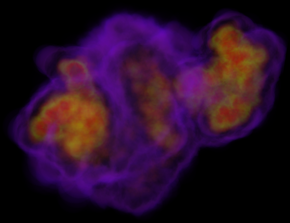

SIMDVoxelizer is a CPU-based voxalizer taking advantage of vectorization units to speed up creation
of 8bit raw volumes.

```
usage: SIMDVoxelizer <voxel_size> <cutoff_distance> <input_file> <output_file>
```

Input file is a binary array of floats: x, y, z, radius and value of elements. Each voxel of the
final volume contains the sum of all elements with a weight that correspond to the value of the
element divided by its squared distance to the voxel. Note that in the final volume, values are
normalized.

This is currently a brute force implementation that produces accurate 8bit volumes.

The `<output_file>` is suffixed by the size of the volume.



SIMDVoxelizer makes use of the [Intel ISPC compiler](https://ispc.github.io/) and requires ispc to
be in the PATH.

To build SIMDVoxelizer, simply run make in the source folder.
```
make
```
